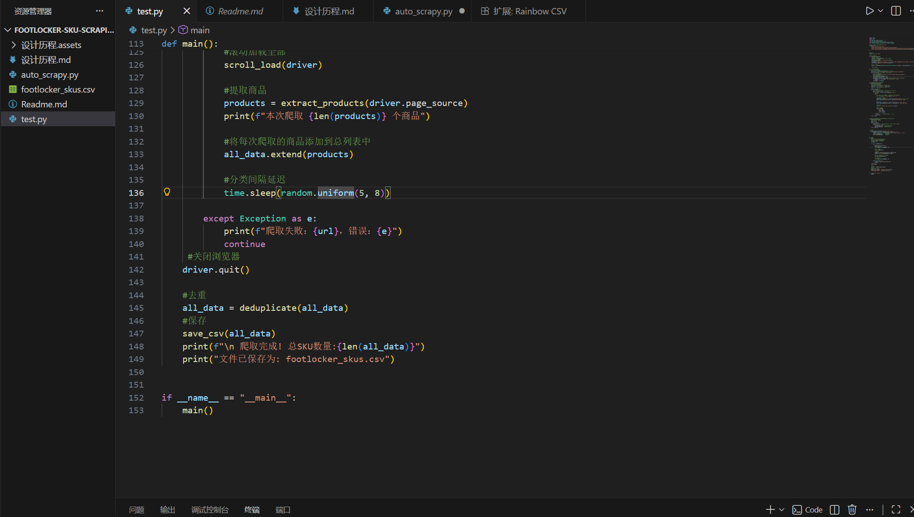
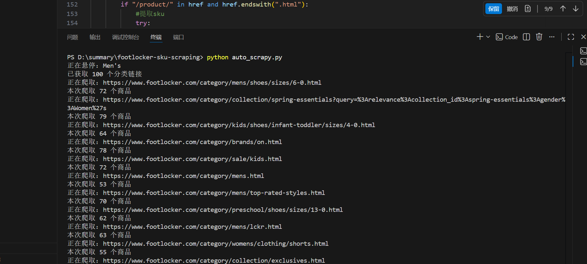

# Footlocker SKU 爬虫

[TOC]

## 项目需求

- 尽量抓所有的sku

## 技术栈
- Python
- Selenium
- BeautifulSoup

## 开始项目

### 下载依赖

pip install selenium

pip install beautifulsoup4

pip install webdriver-manager

### 运行项目

- 1.代理端口填写

proxy = "127.0.0.1:xxxx"填充为自己的代理端口  

- 2.运行程序  当前目录终端下，python auto_scrapy.py
- 运行后请将窗口最大化打开，避免因为找不到组件而导致爬取为0

注：

test 为测试用例，手动添加url进行爬取sku，检查爬虫功能是否实现

并保存至csv文件，包含信息sku，name，price，url

在test基础上，设计了copy_auto.py 初步实现爬取思路

- 使用爬虫添加隐藏二级菜单中各个板块的链接

优化悬停逻辑实现链接获取和爬取，在auto_scrapy.py中实现sku尽可能爬取

category_urls = []  列表用于存放链接

