# 设计并完成项目的新路历程

[TOC]

## 一、剖析需求

**需求：尽量抓所有的sku**

### 什么是SKU（确实不了解，于是搜索）

- **Stock Keeping Unit** 的缩写，直译为“库存量单位”。
- **是用于唯一标识一款商品（或产品变体）的代码**。（个人理解像是数据库中的主键）

于是带着个人理解去搜索主键与SKU的关系。

**AI给出：**

- **在理想的设计中，SKU 应该作为业务主键；但在实际的复杂系统中，SKU 通常不是数据库物理表的主键，而是具有唯一约束的业务字段**

- 在作**用域，生成方，稳定性，可读性，是否暴漏**  五个维度上  有所不同

- 总结**为什么区分**：主键服务于数据库的**稳定关联**，SKU 服务于业务的**可读与可操作**，两者职责不同。

### 什么能爬什么不能爬

...其实在这个命题下有点多此一举，毕竟只是爬取sku相关，但为了规范化还是走一遍

- **/robots.txt** ，查看 Footlocker的爬虫协议

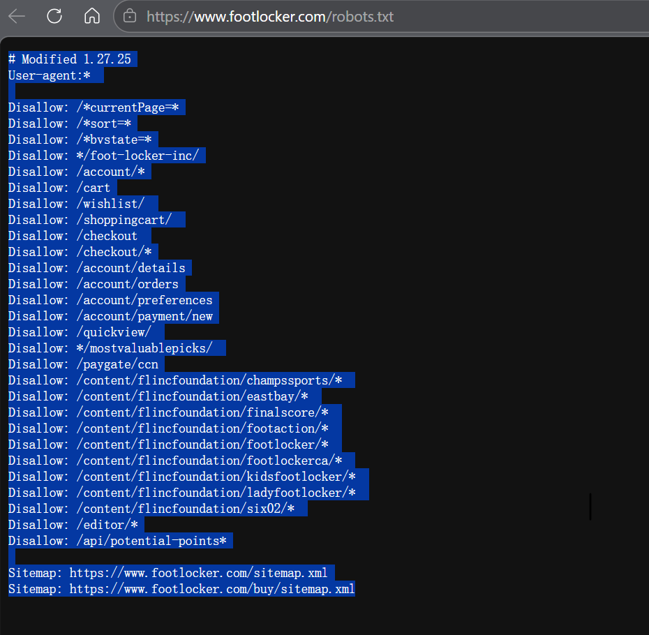

### 找到SKU

- **页面中F12检查**

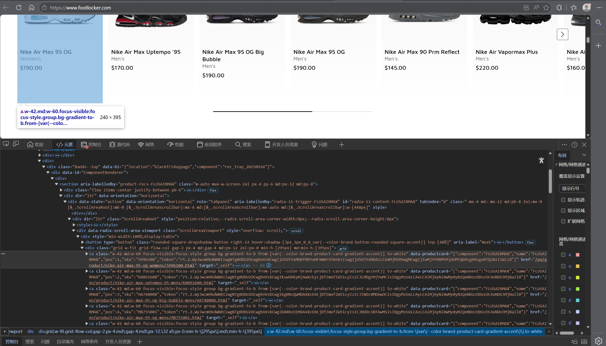

在category/sport/basketball/mens/shoes.html分类页中也检查

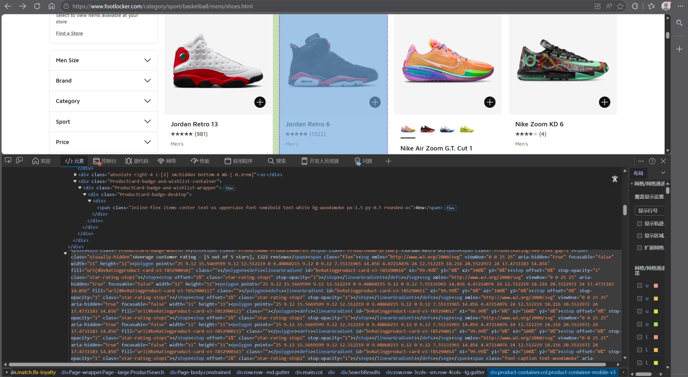

**发现sku位置位于href 链接和src图片链接里，且组成为英文 + 数字的编码**

### 总结SKU格式：

- **商品链接中：/product/名称/   SKU   .html**

---

## 二、项目实现

找到了SKU之后，肯定不能只爬取首页，内容太少且没有实现自动翻页（面试中提到了，但在这里不太一样，是用于模拟翻页）

先从目录中看，导航中选择一个Men`s ，检查各个分类，查看跳转的链接

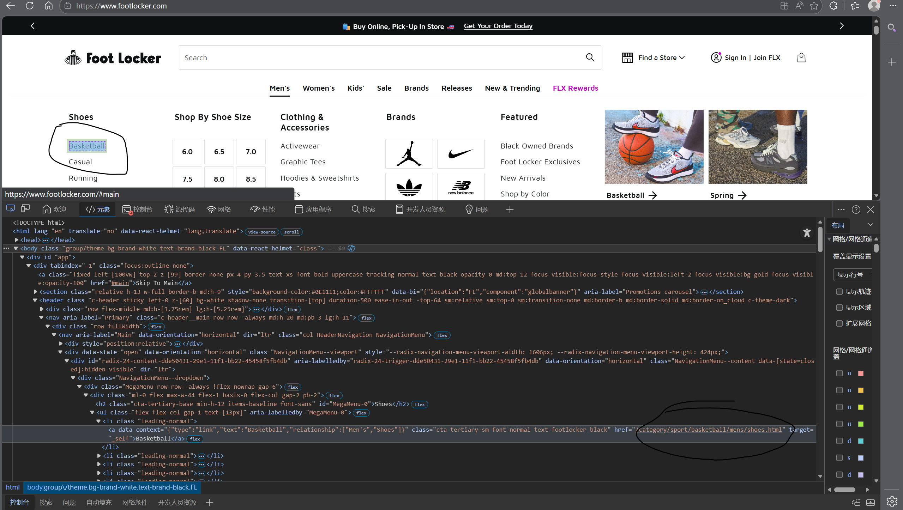

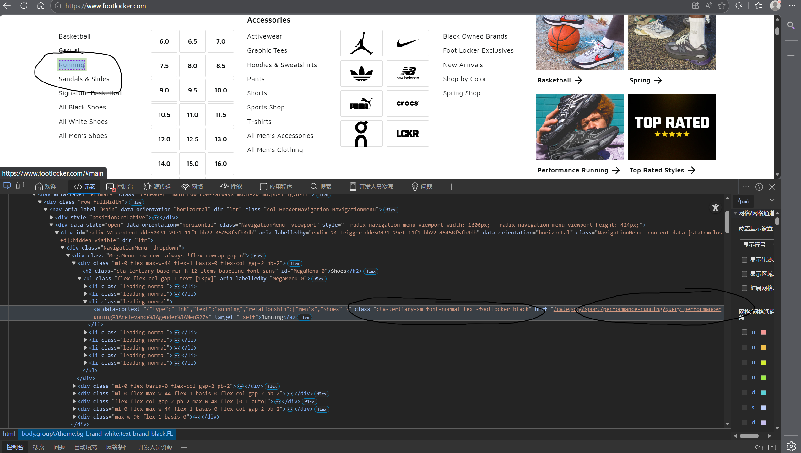

主要从共通点class标签着手，class="cta-tertiary-sm font-normal text-footlocker_black"

- 在这个阶段遇到的痛点是对应隐藏下拉菜单，没有找到通性的标签，每一个组件下的各个图片组成独立部分，相当于我需要在爬取的url中做更多的筛选分成多类

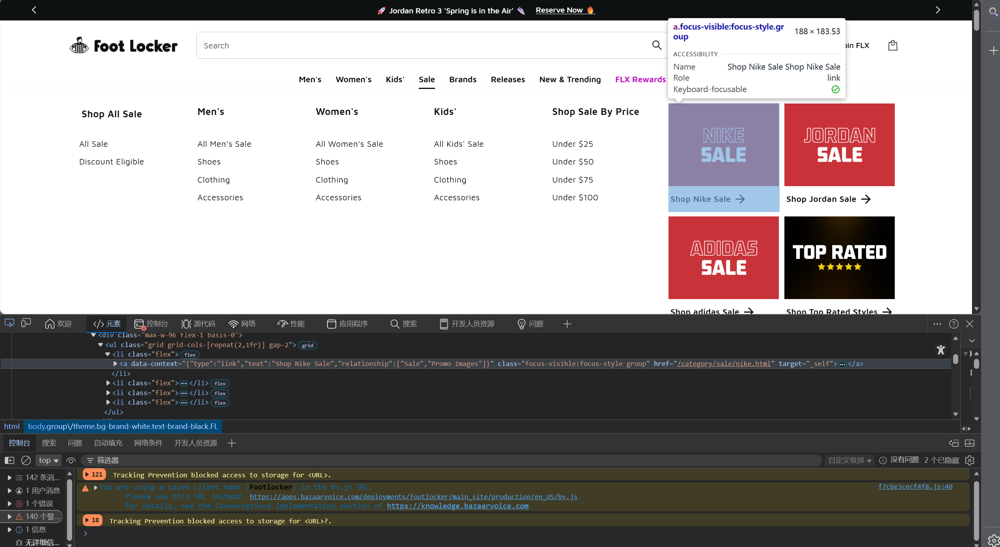

如下图：分成三类

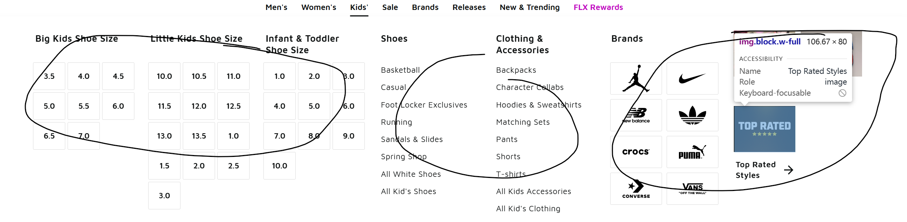

- 着手去做，先将class="cta-tertiary-sm font-normal text-footlocker_black"标签下的进行爬取再说

- 我没有使用过selenium，经过了解发现Selenium 较 DrissionPage的优势为：绕过反爬的方案极多，代理、header、指纹、cookie 都能精细控制。**通过浏览器原生的驱动协议，模拟真人操作浏览器的自动化框架，驱动作为中间层，把你的代码指令翻译成浏览器能听懂的操作命令。**

## 三、设计程序与运行

- 行遇到的问题，代码写的是对的，但 Pylance 可能把 a、name_elem、price_elem 推断成“可能不是 Tag 的联合类型”，给我显示无法找到类和方法的报错，添加无视注释后正常运行。

- 设计了copy_auto.py 初步实现爬取思路

  但是出现问题，无法悬浮在我指定的class标签，并且运行数秒后程序关闭

- 增加了测试用例，因为数据量庞大。仅作测试

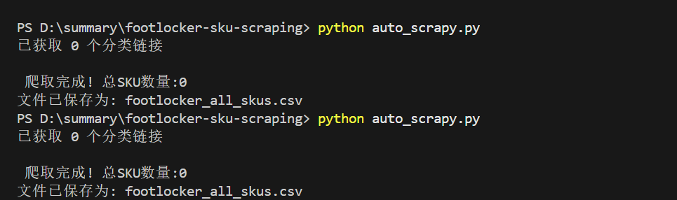

- 小窗时无法找到

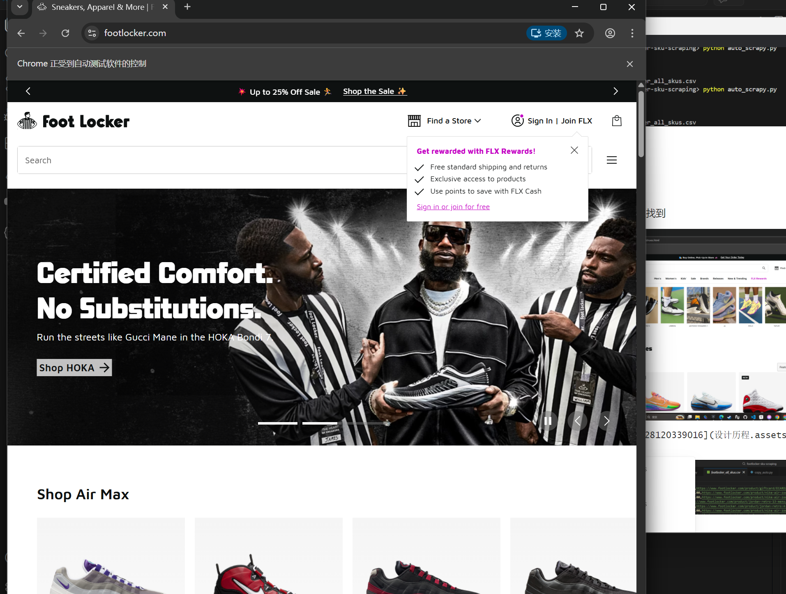

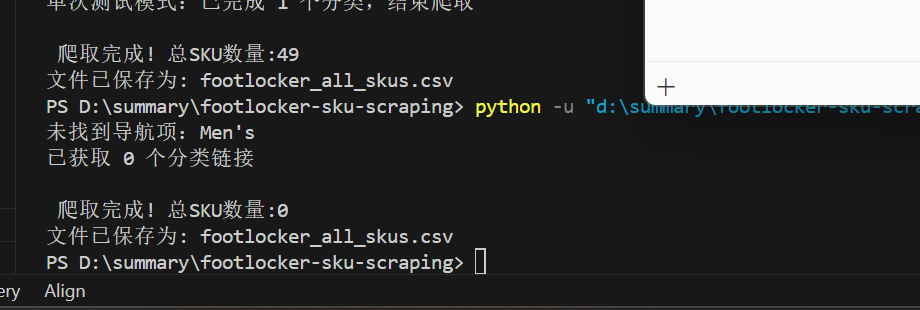

但是窗口扩大时可以找到

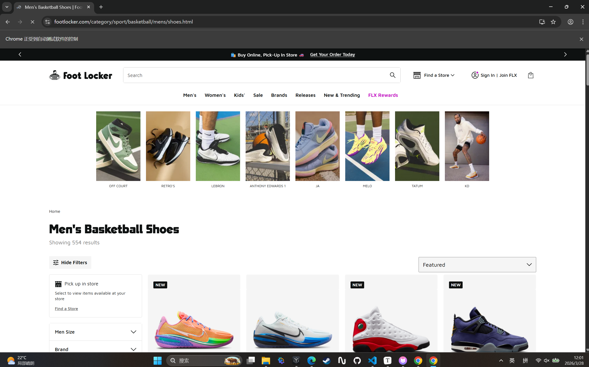

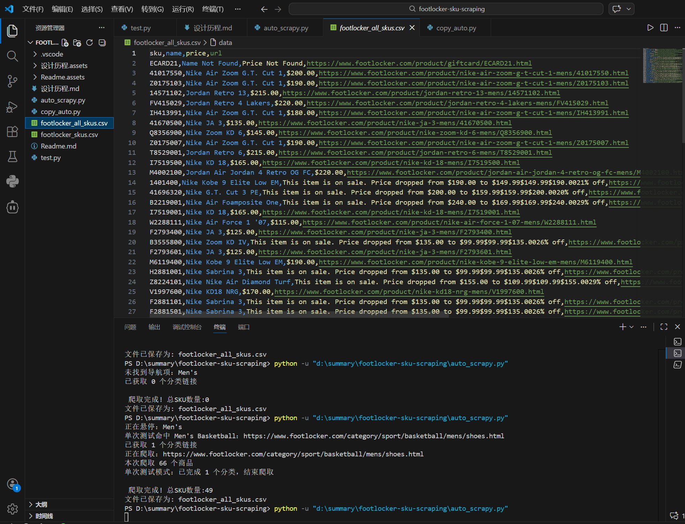